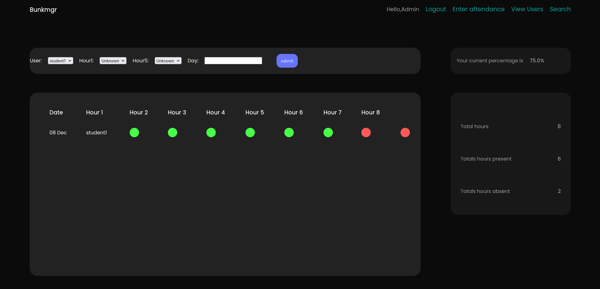

# College Attendance Management Web Application

This is a web application developed in Django that allows teachers to efficiently manage student attendance in a college setting.

## Features

- **Attendance Tracking**: Easily track attendance for each student for different classes or sessions.
- **Attendance Percentage**: Get an overview of the attendance percentage for each student to monitor their presence in classes.
- **Attended Hours**: Keep a record of the number of hours each student has attended.

## Technologies Used

- **Django**: Python-based web framework used for backend development.
- **HTML/CSS**: Frontend design and structure.
- **SQLite**: Database system used for storing attendance records.

## Installation

1. Clone the repository: `https://github.com/srvshbskr/BunkManager.git`
2. Navigate to the project directory.
3. Install dependencies: `pip install -r requirements.txt`
4. Run migrations: `python manage.py migrate`
5. Start the development server: `python manage.py runserver`

## Usage

1. Access the web application through your browser.
2. Register as a teacher or log in if you already have an account.
3. Start managing attendance by adding students, classes, and tracking their attendance.

## Contributing

Contributions are welcome! Feel free to open issues or submit pull requests.

## Acknowledgments

Special thanks to the Django community for their excellent documentation and resources.

## Screenshots

